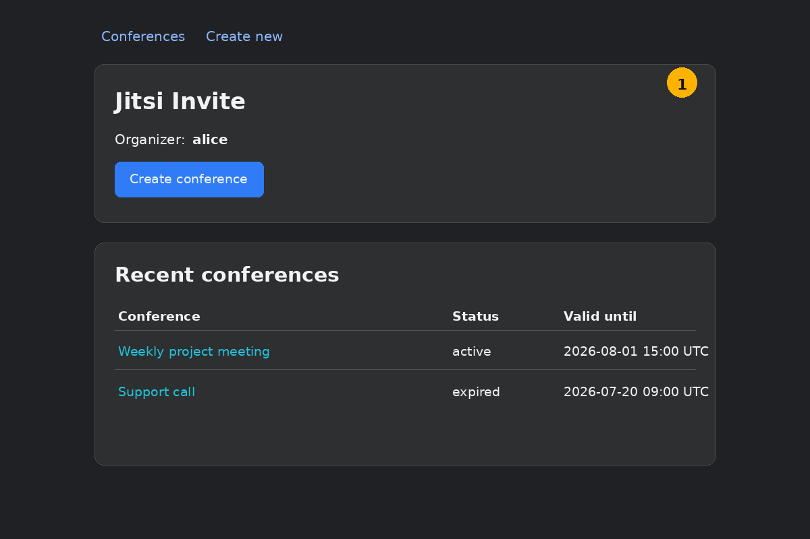
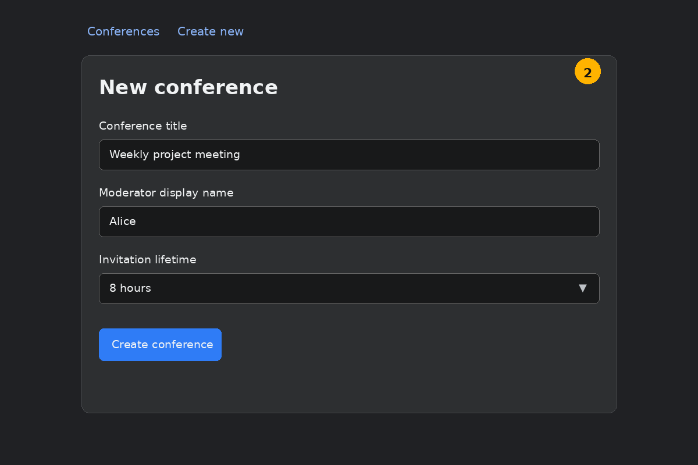
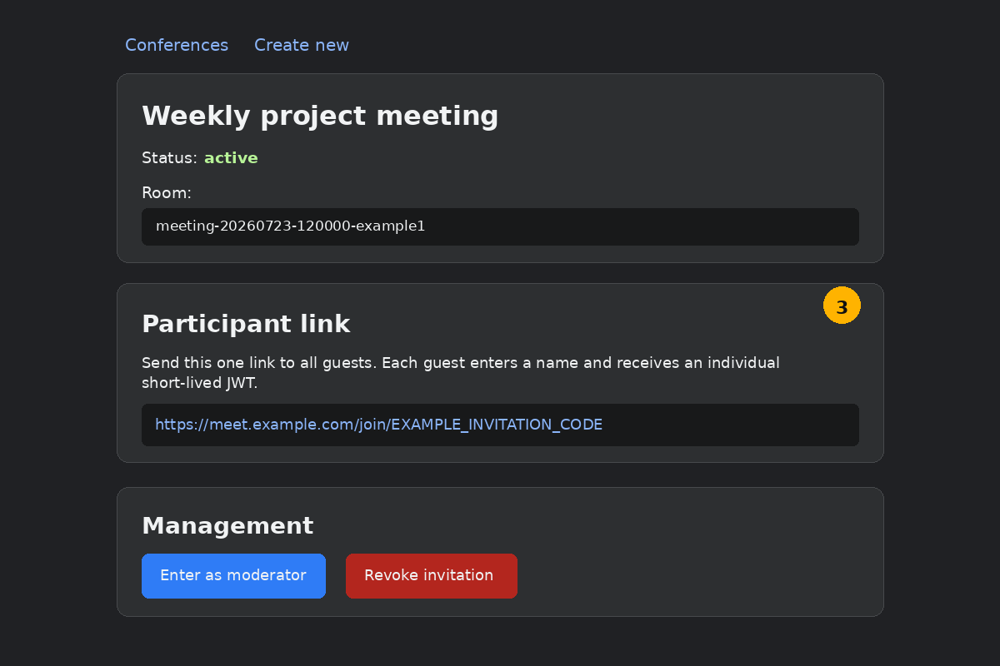
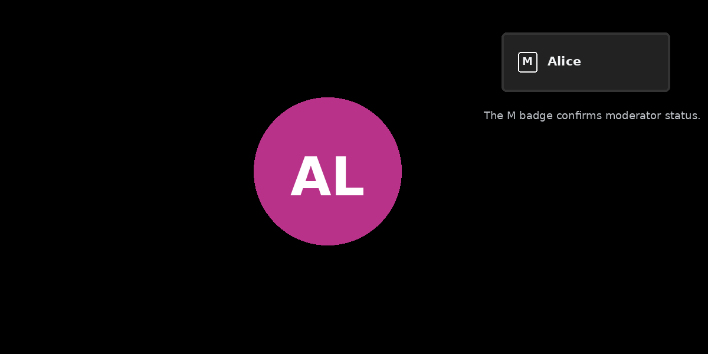

# Moderator Guide: Creating a Conference

This guide is for people who have an organizer account for the protected
Jitsi Invite portal.

> The screenshots are sanitized documentation mockups based on the portal
> layout. The exact browser chrome, colors, and localization may differ.

## 1. Open the organizer portal

Open:

```text
https://meet.example.com/invite/
```

Enter the organizer username and password supplied by the administrator.

After sign-in, the dashboard shows conferences created by your account.



Select **Create conference**.

## 2. Enter conference details

Complete the form:

- **Conference title** — a recognizable title shown in the portal and on the
  guest join page.
- **Moderator display name** — the name shown for you inside Jitsi.
- **Invitation lifetime** — 1, 2, 4, 8, 12, or 24 hours, or permanent.



Select **Create conference**.

A permanent invitation does not create a permanent JWT. Every moderator and
guest still receives a separate short-lived, room-bound token.

## 3. Share the participant link

The conference page displays one reusable **Participant link**.



Copy only the participant link and send it to guests:

```text
https://meet.example.com/join/EXAMPLE_INVITATION_CODE
```

Each guest:

1. opens the participant link;
2. enters a display name;
3. receives an individual short-lived guest JWT;
4. enters the assigned room as a regular participant.

Do not send guests:

- the bare Jitsi room URL;
- a URL containing a moderator JWT;
- your organizer portal credentials.

## 4. Enter before the guests

On the conference page, select **Enter as moderator**.

The portal creates a short-lived moderator JWT and redirects you to the
assigned Jitsi room.

The moderator should enter before guests. The deployment may reject guests
until a JWT-authenticated moderator is present.

## 5. Confirm moderator status

After entering Jitsi, confirm that your participant tile shows the moderator
badge.



A guest must not display the moderator badge or receive moderator controls.

## 6. Run the conference

Use the normal Jitsi controls for microphone, camera, screen sharing, chat,
participant management, and meeting security.

The participant invitation may be reused by multiple guests during its active
lifetime, but every guest receives an individual JWT after entering a name.

## 7. Revoke the invitation when appropriate

Return to the protected conference page and select **Revoke invitation** when
the reusable participant link should no longer issue new guest tokens.

Revocation prevents new moderator and guest tokens from being issued through
that invitation. A token already issued before revocation may remain usable
until its own expiration time.

For short one-time meetings, revoke the invitation after the conference.
For recurring meetings, use a permanent invitation only when the reuse is
intentional.

## Security checklist

Before sending an invitation:

- verify the conference title and lifetime;
- share only the participant link;
- keep organizer credentials private;
- enter through **Enter as moderator**, not through a bare room URL.

During the meeting:

- confirm that you have the moderator badge;
- confirm that guests do not have moderator badges;
- remove unknown participants when necessary.

After the meeting:

- revoke invitations that should not be reused;
- close the Jitsi tab;
- report unexpected moderator privileges to the administrator.

## Troubleshooting

### The organizer portal shows `401 Authorization Required`

The username or password was not accepted, or the browser cached a failed
Basic Auth attempt. Close all browser windows, clear active logins, and try
again. Contact the administrator if the account needs a password reset.

### The invitation is expired or revoked

Create a new conference or ask the original organizer to issue a new
invitation.

### A guest receives moderator privileges

Stop using the room and notify the administrator. The server must have
Jicofo automatic ownership disabled:

```hocon
jicofo.conference.enable-auto-owner = false
```

### The bare room URL asks for authentication

That is expected. Strict JWT mode requires participants to enter through the
portal-generated moderator or participant flow.
